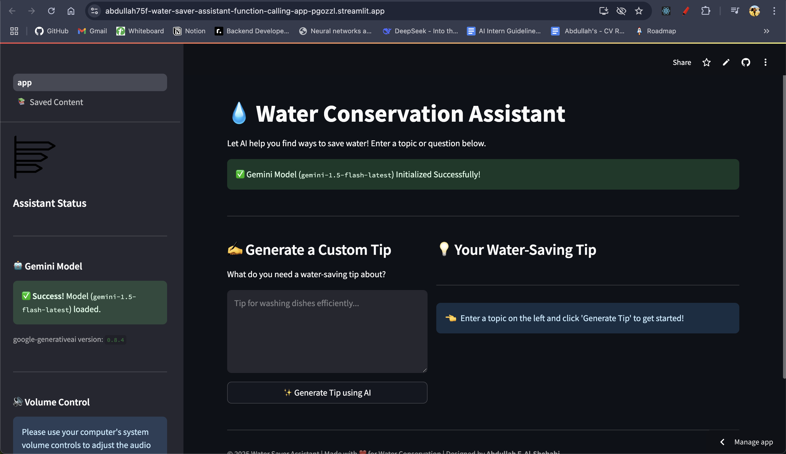
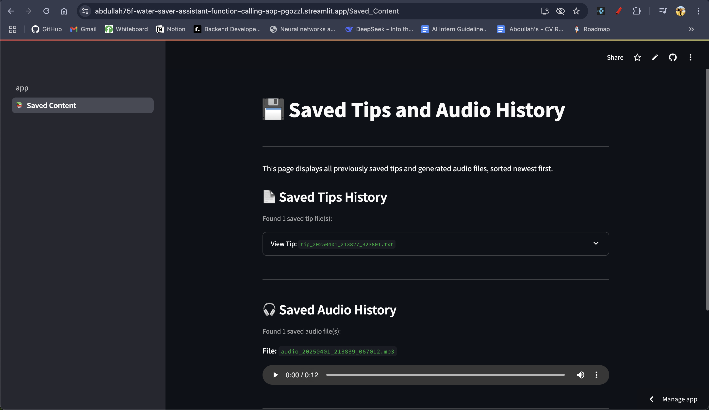

# 💧 Water Conservation Assistant

Check it out using Streamlit url here 👉: [](https://abdullah75f-water-saver-assistant-function-calling-app-pgozzl.streamlit.app/)

An interactive web application built with Streamlit and powered by Google Gemini AI to generate, save, and listen to water conservation tips.

## 🚀 Live Demo & Screenshots

- **View Live App:** [**Check it out**](https://abdullah75f-water-saver-assistant-function-calling-app-pgozzl.streamlit.app/)
- **Main App Interface:**
  
- **Saved Content Page:**
  

## ✨ Overview

This application provides users with actionable water-saving tips. Users can:

- Enter a topic (e.g., "gardening", "showering") to get a custom tip generated by Google's Gemini AI model (`gemini-1.5-flash-latest`).
- Save the generated tip to a unique text file with a timestamp.
- Generate Text-to-Speech (TTS) audio for the tip, saved as a unique MP3 file with a timestamp.
- Access a separate "Saved Content History" page to view the history of all saved text tips and listen to all generated audio files, sorted newest first.

## 🛠️ Tech Stack

- **Frontend:** [Streamlit](https://streamlit.io/)
- **AI Model:** [Google Gemini AI](https://ai.google.dev/) (via `google-generativeai` library)
- **Text-to-Speech:** [gTTS](https://gtts.readthedocs.io/en/latest/) (Google Text-to-Speech library)
- **Language:** Python 3.x

## 📋 Features

- **AI-Powered Tip Generation:** Get relevant water conservation tips using Gemini AI.
- **Persistent & Unique Text Saving:** Save useful tips as timestamped `.txt` files in the `saved_tips/` directory.
- **Persistent & Unique Audio Generation:** Convert tips to speech and save as timestamped `.mp3` files in the `saved_audio/` directory.
- **Multi-Page Interface:** Separate pages for tip generation/saving and viewing saved history.
- **History View:** Browse and read all previously saved text tips in an expandable format.
- **Audio Playback History:** Listen to all previously generated audio files with individual players.
- **Clear Status Feedback:** Provides messages for successful saves, generations, and model initialization status.

## ⚙️ Setup & Local Development

To run this application locally, follow these steps:

1.  **Prerequisites:**

    - Python 3.8+ installed.
    - Git installed.

2.  **Clone the Repository:**

    ```bash
    # Replace with your actual repository URL if different
    git clone https://github.com/YourUsername/YourRepositoryName.git
    cd YourRepositoryName
    ```

3.  **Create and Activate a Virtual Environment** (Recommended):

    ```bash
    # On macOS/Linux
    python3 -m venv venv
    source venv/bin/activate

    # On Windows
    python -m venv venv
    .\venv\Scripts\activate
    ```

4.  **Install Dependencies:**

    ```bash
    pip install -r requirements.txt
    ```

5.  **Set Up API Key (Secrets):**

    - You need a Google Gemini API key. Get one from [Google AI Studio](https://aistudio.google.com/app/apikey).
    - Create a directory named `.streamlit` in the project root if it doesn't exist: `mkdir .streamlit`
    - Create a file named `secrets.toml` inside the `.streamlit` directory.
    - Add your API key to `secrets.toml`:
      ```toml
      # .streamlit/secrets.toml
      GEMINI_API_KEY = "YOUR_API_KEY_HERE"
      ```
    - **Important:** The `.streamlit` directory should be added to your `.gitignore` file to prevent accidentally committing your secret key.

6.  **Run the Streamlit App:**
    ```bash
    streamlit run app.py
    ```
    The application should open in your web browser at `http://localhost:8501`. Navigate between the main app and the "Saved Content History" page using the sidebar.

## ✍️ Author

- Designed by **Abdullah F. Al-Shehabi**

Made with ❤️ for Water Conservation.
